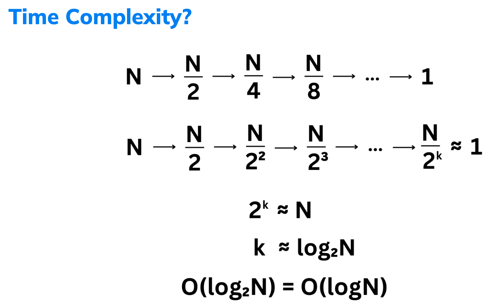

# Binary Search
### 1. Definition
- Binary search is an efficient algorithm for finding an item from a sorted list of items. 
- It works by repeatedly dividing the portion of the list that could contain the item in half until you've narrowed the possible locations to just one.

### 2. Key Characteristics
- Sorted Input: Binary search requires the input array to be sorted.
- Divide and Conquer: It repeatedly divides the search interval in half.
- Efficiency: Its time complexity is O(logn), making it much more efficient than linear search O(n) for large datasets.


### 3. Example
- [Binary Search](https://leetcode.com/problems/binary-search/description/)
```python
def search(self, nums: List[int], target: int) -> int:
    left, right = 0, len(nums) - 1
    while left <= right:
        mid = (left + right) // 2
        if nums[mid] == target:
            return mid
        elif nums[mid] < target:
            left = mid + 1
        else:
            right = mid - 1
    return -1
```

### 4. Use Cases
- Finding an Element: Quickly locating an element in a sorted array.
- Bounds Checking: Finding the first or last position of an element (variant: lower_bound, upper_bound).
- Search Problems: Problems involving the search of a sorted space, such as finding the peak element, finding the minimum in rotated sorted arrays, etc.